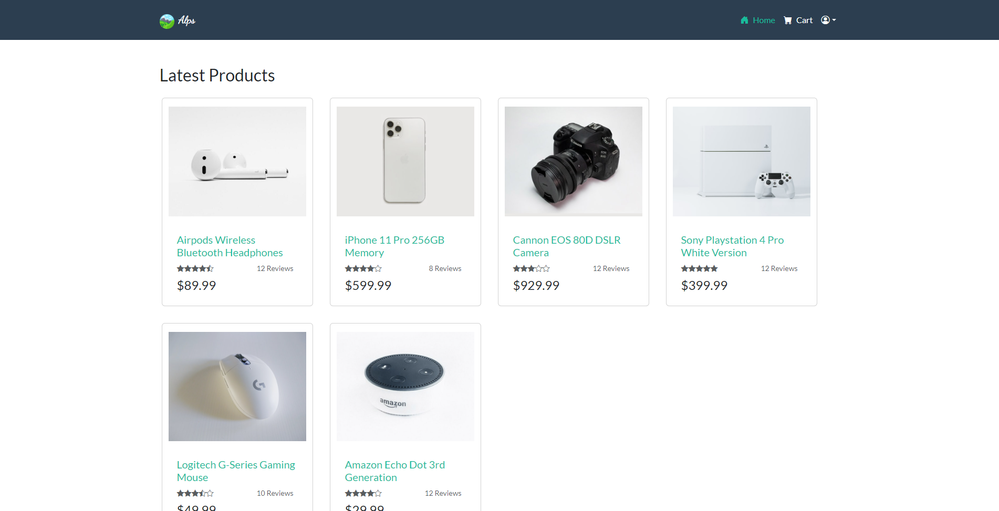
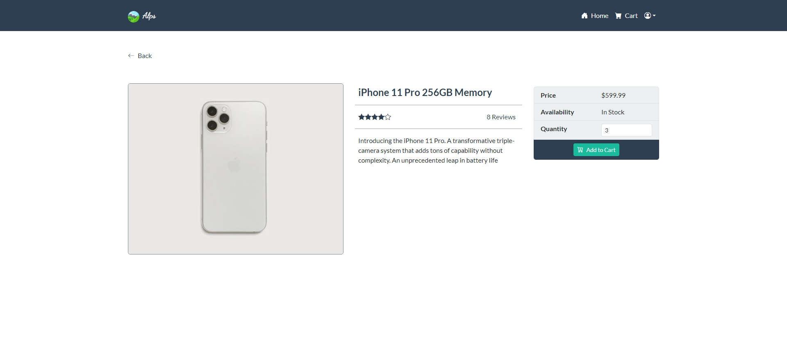
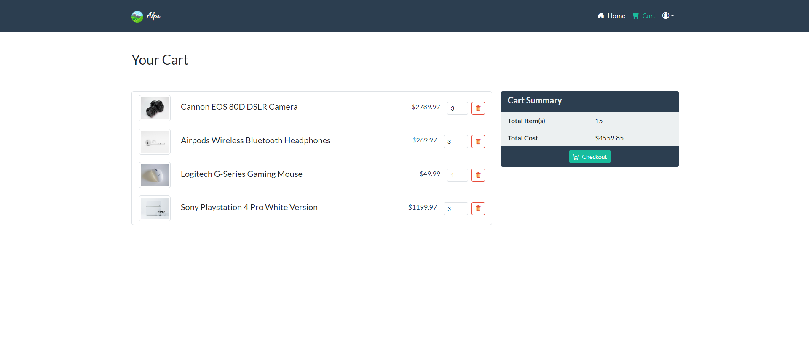

# alp

Alp is an online shopping platform, made using the MERN web-application stack. It allows for customers to browse, select, and purchase products.

## Getting Started

The project makes use of [MERN web-application stack](https://www.mongodb.com/mern-stack).

* Clone this repository to your local machine:
```shell
git clone https://github.com/mdmubin/alp.git
```

* Install the project dependencies:

In the root project directory, type the following commands
```shell
npm install # backend libs
cd client
npm install # frontend libs
```
* Seed the data into the database
In the root project directory, type the following commands
```shell
npm run data:seed
```
This will run a script which will seed mongodb with the data required for `alp`.

### Start the development server:

In the root project directory, type the following commands:

1. To start up the backend server
```shell
npm start
```

2. To start up the front-end:

```shell
cd client && npm run dev
```
Open your web browser and navigate to http://localhost:5173 to access the Application.


# Screenshots

* Home Screen
  
* Item View
  
* Cart View
  

---

### Dev Environment
- Node.js:  `v18.17.0`
- MongoDB: `v6.0.x`
- See [package.json](https://github.com/mdmubin/alp/blob/main/package.json) for versions of individual libraries
